# Rapport d'audit — TaskFlow
**Auteur :** FAUPIN Rémi  
**Date :** 02/06/2026  
**Module :** Télémétrie & Instrumentation Web — ESGI

---

## Partie 1 — Audit du code

### Bug 1 — Augmentation de la cardinalité à cause du label "user_id" dans Prometheus

Dans le fichier server.js ligne 31 et 81

Prometheuse stocke chaque label unique.
user_id est donc un label unique et est enregistrer à chaque fois. Mais en production cela peut poser problème. Si il y a des millier d'utilisateur alors tous les labels seront stockés ce qui va fortement augmenter le stockage dans la mémoire qui risque de faire planter Prometheuse
Il ne faut pas mettre une valeur qui peut augmenter dans un label prometheuse.

**Modification dans le code :**

```
// avant
ligne 31 :
labelNames: ['method', 'route', 'status', 'user_id'],

ligne 81:
httpRequestsTotal.labels(req.method, route, String(res.statusCode), userId).inc();

// apres
ligne 31 :
labelNames: ['method', 'route', 'status'],
ligne 81 :
httpRequestsTotal.labels(req.method, route, String(res.statusCode)).inc();
```

**Avant :**
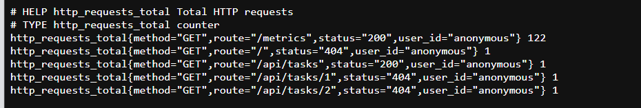

**Après :**
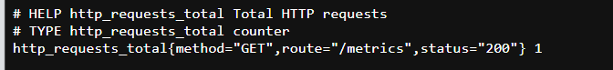


---

### Bug 2 — Augmentation de la cardinalité à cause des routes dynamiques non normalisées

Dans le fichier server.js ligne 77

Problème similaire au bug 1 : 

Prometheuse stocke chaque chemin de route unique. Le chemin brut de la requête est utilisé comme label, donc /api/tasks/1, /api/tasks/2, /api/tasks/99 sont tous enregistrés séparément. Mais en production cela peut poser problème. Si il y a des milliers de tâches créées alors tous les chemins seront stockés ce qui va fortement augmenter le stockage dans la mémoire qui risque de faire planter Prometheuse. Il ne faut pas mettre une valeur qui peut augmenter dans un label Prometheuse, il faut utiliser le template de route (/api/tasks/:id) à la place.

Modification dans le code :

```
// avant
ligne 77 :
const route = req.path;

// après
ligne 77 :
const route = req.route?.path || req.path.replace(/\/\d+/g, '/:id');

```

**Avant :**

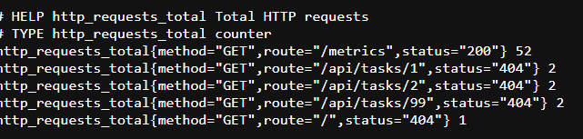


**Après :**
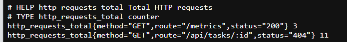


---

### Bug 3 — Contentement RGPD : consentement opt-out au lieu d'opt-in

Dans le fichier tracker.js ligne 8

Par défaut, le tracking est activé même si l'utilisateur n'a jamais donné son accord. La condition localStorage.getItem('consent') !== 'no' retourne true quand le localStorage est vide (première visite), ce qui veut dire que les événements sont envoyés sans consentement explicite. Mais en production cela pose un problème légal. La RGPD impose un consentement opt-in : le tracking doit être désactivé par défaut et s'activer uniquement après que l'utilisateur ait cliqué sur "Accepter".

**Modification dans le code :**

```
// avant
ligne 8 :
let consentGiven = localStorage.getItem('consent') !== 'no';

// après
ligne 8 :
let consentGiven = localStorage.getItem('consent') === 'yes';

```

**Avant :**
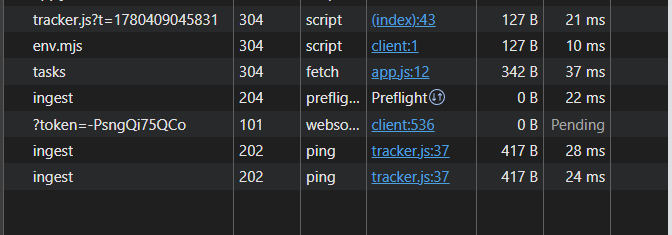


**Après :**

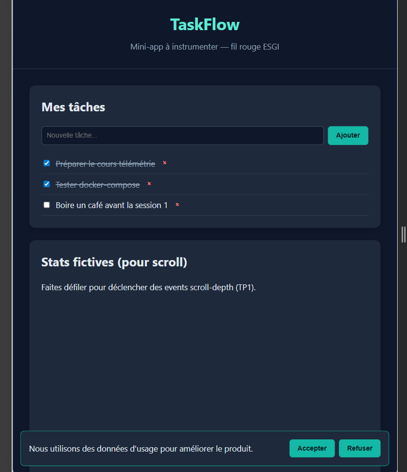

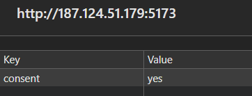

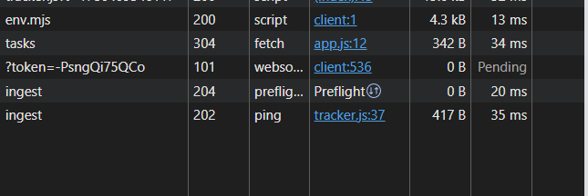

---

### Bug 4 — Tracking du Scroll envoyé en boucle 

Dans le fichier tracker.js lignes 63-72

Le tracker envoie un événement scroll_depth à chaque fois que l'événement scroll se déclenche. L'événement scroll se déclenche des dizaines de fois par seconde quand l'utilisateur scroll. Il n'y a aucun enregistrement des paliers déjà envoyés, donc si l'utilisateur est à 75% de la page, les paliers 25, 50 et 75 sont tous renvoyés à chaque mouvement de scroll. En production cela pose problème. Les données sont corrompues car les mêmes événements sont enregistrer des dizaines de fois et l'API (/api/ingest) est surchargée. Il faut enregistrer les paliers déjà envoyés pour les envoyer qu'une seule fois.

**Modification dans le code :**

```
// avant
window.addEventListener('scroll', () => {
  const max = document.documentElement.scrollHeight - window.innerHeight;
  if (max <= 0) return;
  const pct = Math.round((window.scrollY / max) * 100);
  for (const m of [25, 50, 75, 100]) {
    if (pct >= m) {
      track('scroll_depth', { percent: m });
    }
  }
});

// apres
const scrollMilestonesSent = new Set();
window.addEventListener('scroll', () => {
  const max = document.documentElement.scrollHeight - window.innerHeight;
  if (max <= 0) return;
  const pct = Math.round((window.scrollY / max) * 100);
  for (const m of [25, 50, 75, 100]) {
    if (pct >= m && !scrollMilestonesSent.has(m)) {
      scrollMilestonesSent.add(m);
      track('scroll_depth', { percent: m });
    }
  }
});

```
**Avant :**
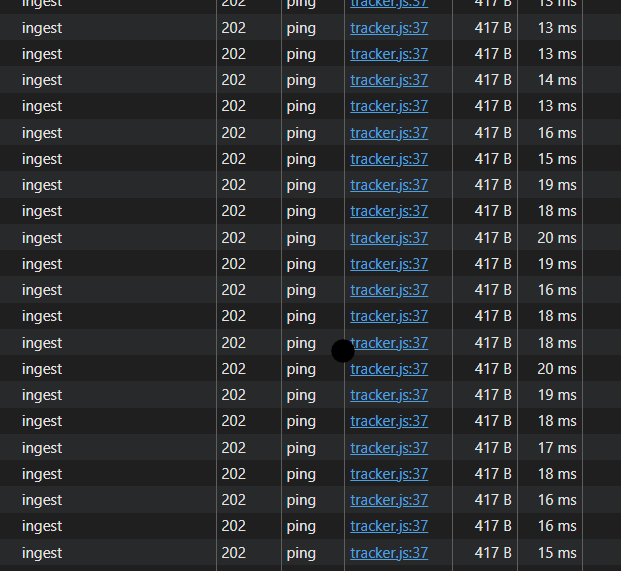


**Après :**

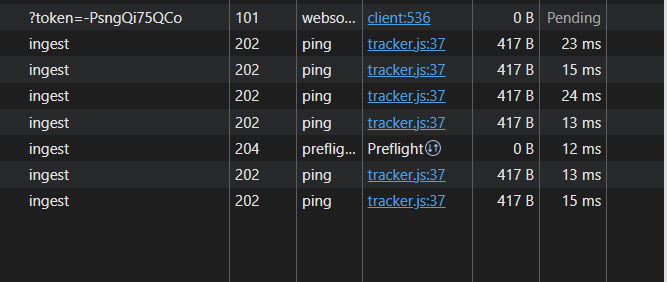

---

### Bug 5 — Requête PromQL incorrecte sur le panel de latence Grafana

Dans le fichier golden-signals.json lignes 73, 78, 83

Les requêtes PromQL utilisées pour calculer les percentiles de latence (p50, p95, p99) n'agrègent pas correctement les buckets de l'histogramme. Sans le `sum(...) by (le)` Prometheuse calcule le quantile mais séparément pour chaque combinaison de labels (method, route, status), ce qui produit des dizaines de courbes à la place d'une latence globale. En production cela pose problème. Le dashboard affiche des données fausses et illisibles, ce qui rend la surveillance des performances impossible.

**Modification dans le code :**

```
// avant
"expr": "histogram_quantile(0.50, rate(http_request_duration_seconds_bucket[5m]))"
"expr": "histogram_quantile(0.95, rate(http_request_duration_seconds_bucket[5m]))"
"expr": "histogram_quantile(0.99, rate(http_request_duration_seconds_bucket[5m]))"

// après
"expr": "histogram_quantile(0.50, sum(rate(http_request_duration_seconds_bucket[5m])) by (le))"
"expr": "histogram_quantile(0.95, sum(rate(http_request_duration_seconds_bucket[5m])) by (le))"
"expr": "histogram_quantile(0.99, sum(rate(http_request_duration_seconds_bucket[5m])) by (le))"
```

**Avant :**
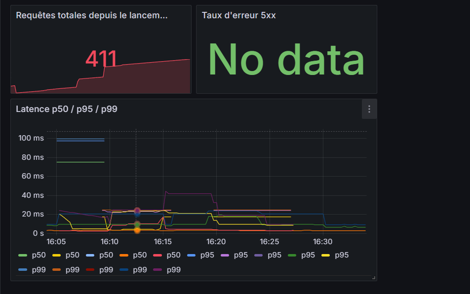


**Après :**

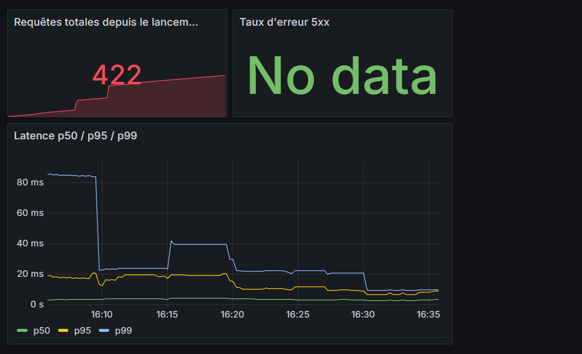

---

## Partie 2 — Analyse des données

### Dashboard Metabase
#### Carte 1 — DAU sur 30 jours

**Capture :**
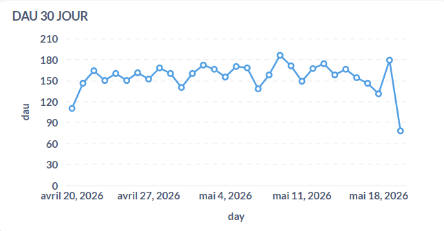

**Requête SQL :**

```sql
SELECT
  CAST("public"."events_raw"."occurred_at" AS date) AS "occurred_at",
  count(distinct "public"."events_raw"."user_id") AS "count"
FROM
  "public"."events_raw"
GROUP BY
  CAST("public"."events_raw"."occurred_at" AS date)
ORDER BY
  CAST("public"."events_raw"."occurred_at" AS date) ASC
```
---
Le dataset affiche les données sur 30 jours . Le DAU
est entre 78 et 186 utilisateurs actifs par jour. On n'observe pas de tendance de croissance nette mais plutôt une moyenne :
le trafic est stable, sans pics anormaux, ce
qui confirme un dataset simulé à débit constant.


---

#### Carte 2 — Funnel global

**Capture :**
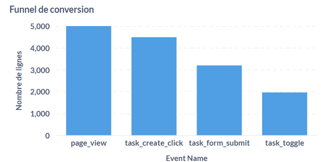

**Requête SQL :**

```sql
SELECT
  "public"."events_raw"."event_name" AS "event_name",
  COUNT(*) AS "count"
FROM
  "public"."events_raw"
WHERE
  ("public"."events_raw"."event_name" = 'page_view')
 
    OR (
    "public"."events_raw"."event_name" = 'task_create_click'
  )
  OR (
    "public"."events_raw"."event_name" = 'task_form_submit'
  )
  OR ("public"."events_raw"."event_name" = 'task_toggle')
GROUP BY
  "public"."events_raw"."event_name"
ORDER BY
  "public"."events_raw"."event_name" ASC
```

Le funnel a 5 000 page_view, 4 490 task_create_click
, 3 198 task_form_submit  et
1 963 task_toggle . La plus forte
diminution se trouve entre task_form_submit et task_toggle :
seulement 61 % des utilisateurs qui soumettent un formulaire
complètent. C'est l'étape la plus fragile du
funnel.
---
#### Carte 3 — Top events

**Capture :**
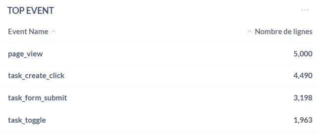

**Requête SQL :**

```sql
SELECT
  "public"."events_raw"."event_name" AS "event_name",
  COUNT(*) AS "count"
FROM
  "public"."events_raw"
GROUP BY
  "public"."events_raw"."event_name"
ORDER BY
  "public"."events_raw"."event_name" ASC
```

Le dataset a 4 événements qui correspondent
aux 4 étapes du funnel. page_view est l'événement le plus
fréquent (5 000), task_create_click (4 490),
task_form_submit (3 198) et task_toggle (1 963). 
---
#### Carte 4 — Conversion par device (page_view → task_form_submit)

**Capture :**
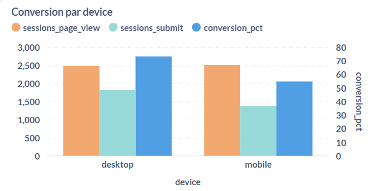

**Requête SQL :**

```sql
SELECT
  device,
  COUNT(DISTINCT CASE WHEN event_name = 'page_view'        THEN session_id END) AS sessions_page_view,
  COUNT(DISTINCT CASE WHEN event_name = 'task_form_submit' THEN session_id END) AS sessions_submit,
  ROUND(
    100.0 *
    COUNT(DISTINCT CASE WHEN event_name = 'task_form_submit' THEN session_id END) /
    NULLIF(COUNT(DISTINCT CASE WHEN event_name = 'page_view' THEN session_id END), 0)
  , 1) AS conversion_pct
FROM events_raw
GROUP BY device
ORDER BY device;
```
Desktop convertit à 73.3 % (1 820 / 2 484 sessions) contre 54.8 %
sur mobile (1 378 / 2 516 sessions), soit un écart de 18,5 points.
À première lecture, cela semble indiquer une expérience mobile
fortement dégradée. Mais cet agrégat brut est trompeur — voir
section Biais identifié.
---

### Biais identifié : Paradoxe de Simpson 

Dans le fichier events.csv, colonnes cohort et device

La Carte 4 montre que sur mobile la convertion est de 18,5 points
de moins que ordinateur (54,8 % vs 73,3 %). On pourrait en conclure
que l'expérience mobile est moin bien. Mais ce résultat est
trompeur : c'est un paradoxe de Simpson causé par la répartition asymétrique des devices entre les
cohortes.

**Démonstration chiffrée :**

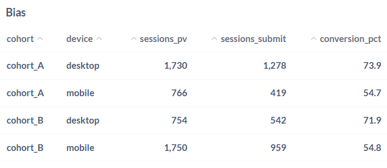

**Requête SQL :**

```sql
SELECT
  cohort,
  device,
  COUNT(DISTINCT CASE WHEN event_name = 'page_view'        THEN session_id END) AS sessions_pv,
  COUNT(DISTINCT CASE WHEN event_name = 'task_form_submit' THEN session_id END) AS sessions_submit,
  ROUND(
    100.0 *
    COUNT(DISTINCT CASE WHEN event_name = 'task_form_submit' THEN session_id END) /
    NULLIF(COUNT(DISTINCT CASE WHEN event_name = 'page_view' THEN session_id END), 0)
  , 1) AS conversion_pct
FROM events_raw
GROUP BY cohort, device
ORDER BY cohort, device;
```
---

### 3 recommandations PM

1. **Mobile convertit 18,5 points de moins que desktop** (54,8 % vs 73,3 %).
   Le formulaire de création de tâche est probablement trop complexe
   sur petit écran. Il faut A/B tester une version mobile simplifiée
   du formulaire (uniquement le champ titre) dès la semaine prochaine,
   en ciblant les nouveaux utilisateurs mobile des deux cohortes.